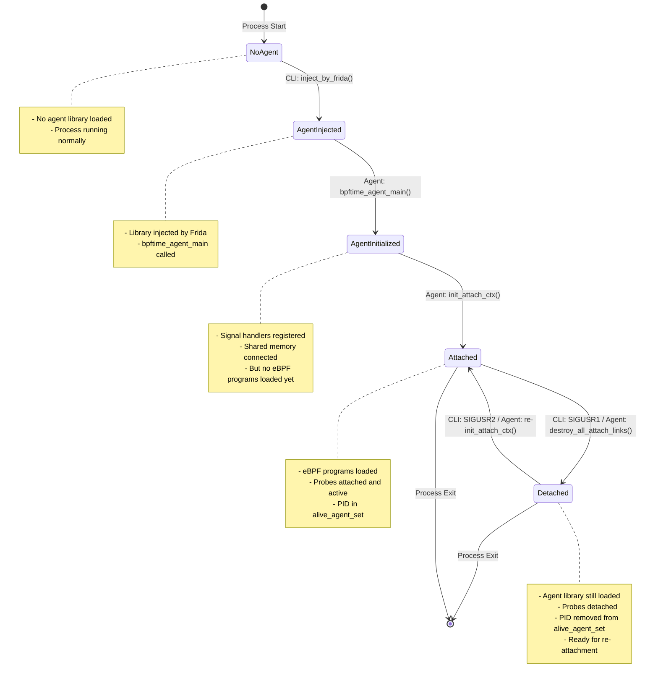
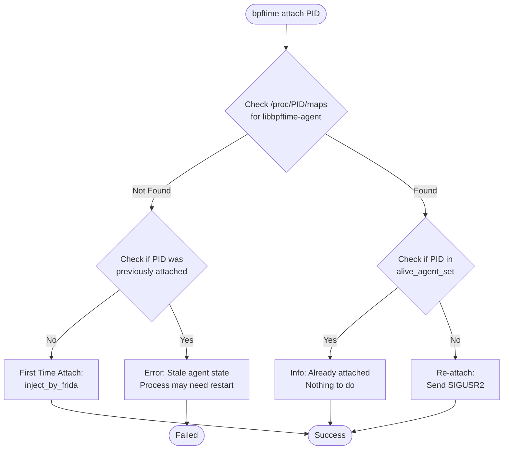
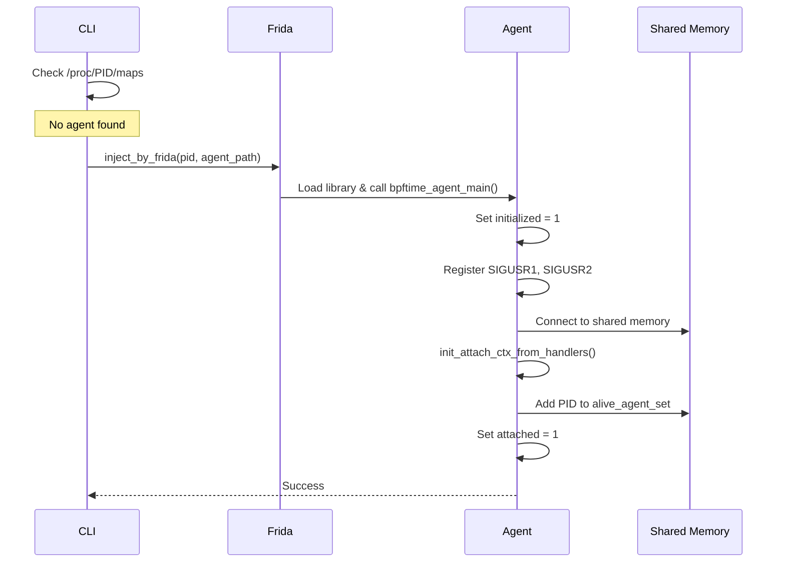
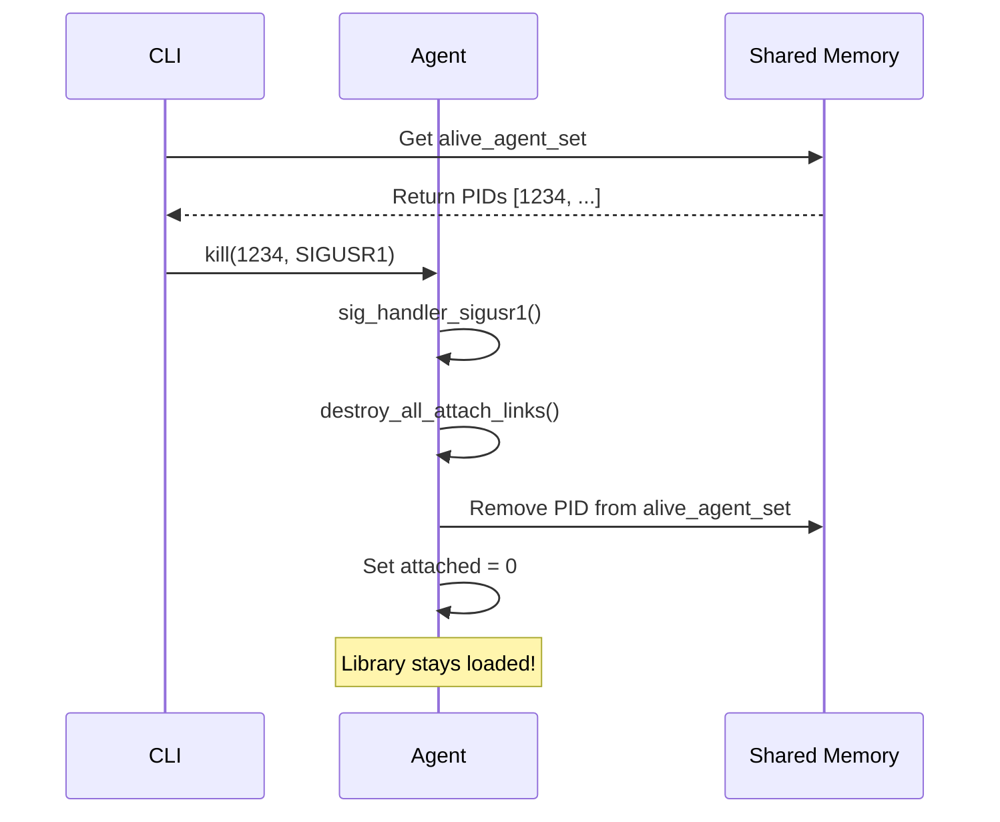
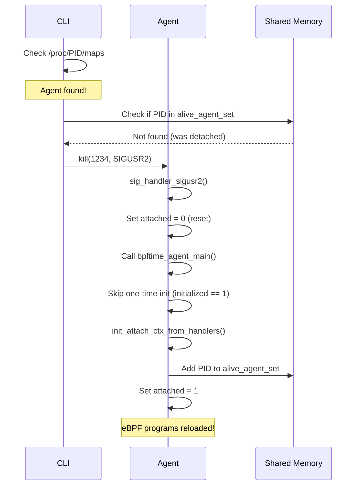

# BPFtime Attach/Detach State Machine and Flow

## State Machine Diagram



## CLI Flow with State Detection



## Agent State Transitions

```mermaid
flowchart TD
    Init([Agent Library Loaded])
    
    Init --> CheckInit{initialized == 0?}
    
    CheckInit -->|Yes| FirstInit[First Initialization:<br/>- Register SIGUSR1/SIGUSR2<br/>- Setup shared memory<br/>- Set initialized = 1]
    
    CheckInit -->|No| CheckAttached{attached == true?}
    
    CheckAttached -->|Yes| Skip[Skip: Already attached]
    
    CheckAttached -->|No| ReInit[Re-initialization:<br/>Just reload eBPF programs]
    
    FirstInit --> LoadPrograms[init_attach_ctx_from_handlers()]
    ReInit --> LoadPrograms
    
    LoadPrograms --> SetAttached[attached = true<br/>Add to alive_agent_set]
    
    SetAttached --> Running([Running])
    
    Running --> SIGUSR1{Receive SIGUSR1}
    
    SIGUSR1 --> Detach[- destroy_all_attach_links()<br/>- Remove from alive_agent_set<br/>- attached = false<br/>- Keep initialized = 1]
    
    Detach --> WaitSignal([Waiting for Signal])
    
    WaitSignal --> SIGUSR2{Receive SIGUSR2}
    
    SIGUSR2 --> ReInit
```

## Implementation Details

### CLI Side (main.cpp)

```cpp
// Pseudo-code for improved attach logic
int attach_command(int pid) {
    // 1. Check if agent is already loaded
    if (is_agent_loaded_in_process(pid)) {
        // 2. Check if currently attached
        if (is_pid_in_alive_set(pid)) {
            spdlog::info("Process {} is already attached", pid);
            return 0;
        } else {
            // 3. Agent loaded but detached - send re-attach signal
            spdlog::info("Re-attaching to process {} via signal", pid);
            return send_reattach_signal(pid);  // SIGUSR2
        }
    } else {
        // 4. Check if this PID was previously attached (stale state)
        if (was_previously_attached(pid)) {
            spdlog::error("Process {} has stale agent state. Restart may be required", pid);
            return 1;
        }
        // 5. Fresh attach - inject with Frida
        spdlog::info("First time attach to process {}", pid);
        return inject_by_frida(pid, agent_path, "");
    }
}

bool is_agent_loaded_in_process(int pid) {
    std::ifstream maps("/proc/" + std::to_string(pid) + "/maps");
    std::string line;
    while (getline(maps, line)) {
        if (line.find("libbpftime-agent") != std::string::npos) {
            return true;
        }
    }
    return false;
}
```

### Agent Side (agent.cpp)

```cpp
// State variables
static int initialized = 0;  // One-time init (signals, shm, etc)
static int attached = 0;     // eBPF programs loaded

static void sig_handler_sigusr2(int sig) {
    SPDLOG_INFO("Re-attaching..");
    // Don't reset initialized - keep signal handlers, etc.
    
    // Reset attached state
    __atomic_store_n(&attached, 0, __ATOMIC_SEQ_CST);
    
    // Re-run attachment logic
    gboolean stay_resident = TRUE;
    bpftime_agent_main("", &stay_resident);
}

extern "C" void bpftime_agent_main(const gchar *data, gboolean *stay_resident) {
    // One-time initialization
    if (__atomic_compare_exchange_n(&initialized, &expected, 1, ...)) {
        // Register signal handlers
        signal(SIGUSR1, sig_handler_sigusr1);  // Detach
        signal(SIGUSR2, sig_handler_sigusr2);  // Re-attach
        
        // Initialize shared memory
        bpftime_initialize_global_shm(...);
        
        // Other one-time setup...
    }
    
    // Check if already attached
    int expected_attached = 0;
    if (!__atomic_compare_exchange_n(&attached, &expected_attached, 1, ...)) {
        SPDLOG_INFO("Already attached, skipping");
        return;
    }
    
    // Load eBPF programs
    ctx_holder.ctx.init_attach_ctx_from_handlers(runtime_config);
    
    // Add to alive set
    shm_holder.global_shared_memory.add_pid_into_alive_agent_set(getpid());
    
    *stay_resident = TRUE;
}

static void sig_handler_sigusr1(int sig) {
    SPDLOG_INFO("Detaching..");
    
    // Destroy attach links
    ctx_holder.ctx.destroy_all_attach_links();
    
    // Remove from alive set
    shm_holder.global_shared_memory.remove_pid_from_alive_agent_set(getpid());
    
    // Reset attached state (but NOT initialized)
    __atomic_store_n(&attached, 0, __ATOMIC_SEQ_CST);
    
    SPDLOG_DEBUG("Detaching done");
}
```

## Benefits of This Approach

1. **No Multiple Injections**: Avoids Frida re-injection complexity
2. **Clean State Management**: Separates one-time init from attach state
3. **Fast Re-attach**: Just a signal instead of full injection
4. **Robust Error Handling**: CLI can detect and report stale states
5. **Backward Compatible**: Existing first-attach flow unchanged

## Edge Cases Handled

1. **Already Attached**: CLI reports and does nothing
2. **Stale Agent**: CLI detects library loaded but not in alive set (crash scenario)
3. **Clean Process**: Normal first-time attach
4. **Detached Process**: Quick re-attach via signal
5. **Process Restart**: Clears all state, allows fresh attach

## Sequence Diagrams

### First Time Attach


### Detach Flow


### Re-attach Flow (Proposed)
